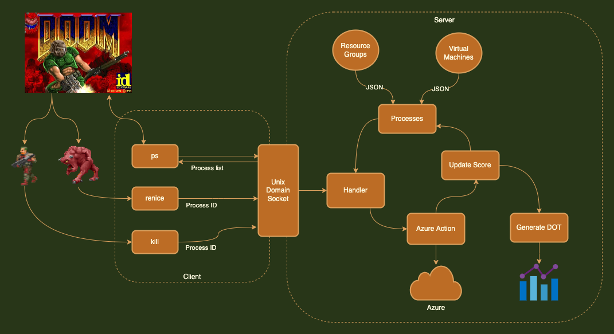

Chaos Bernie implements Azure as an external process source for [psDoom-ng](https://github.com/yeoldegrove/psdoom-ng1). 


> **Warning** 
> **Azure resources will be permanently and irrevocably destroyed: use at your own risk!**

# Background

* 1997: [id Software release source code to DOOM](https://github.com/id-Software/DOOM)
* 1999: psDoom origins and proof of concept - [Doom as a tool for system administration](https://www.cs.unm.edu/~dlchao/flake/doom/)
* 2000: [psDoom](https://psdoom.sourceforge.net/) released
  >  psDooM is a process monitor and manager for *nix systems. It could be considered a graphical interface to the 'ps', 'renice', and 'kill' commands. psDooM is based on XDoom, which is based on id Software's 'Doom'. 
* 2016: [psDoom-ng](https://github.com/yeoldegrove/psdoom-ng1) released, updating psDoom for modern operating systems and support for external process source
  > psdoom-ng is a First Person Shooter operating system process killer based on psDooM and Chocolate Doom.
* 2022: Chaos Bernie written to add Azure virtual machines and resource groups as external processes

# Chaos Bernie

Chaos Bernie was written during an internal hackathon as a fun way to clean up Azure resources. Users are great at spinning up compute resources but often require nagging to deallocate or destroy them. As Bernie would say "Once again I'm asking for you to clean up your compute resources"

Chaos Bernie adds Azure virtual machines and resource groups as external process to psDoom-ng. 

As per the psDoom-ng documentation, DOOM is a single threaded application so any blocking on external scripts makes the game unplayable. Azure resources take a while to delete so golang was chosen for concurrency and unix domain sockets for a simple queue for client to communicate with backend.

This could easily be adapted to other cloud providers (AWS, GCP)

## Architecture




Interaction with psDoom via external process sources
https://github.com/yeoldegrove/psdoom-ng1#support-for-external-process-source

Three commands with their required inputs/outputs
* PSDOOMPSCMD
  * The command must print one space separated line per process with the format: 
    ```text
    <user> <pid> <processname> <is_daemon=[1|0]>
    ```
* PSDOOMRENICECMD
  * input: PID
* PSDOOMKILLCMD
  * input: PID

For Azure, these values have the following definitions

| Variable    | Azure Definition                                          |
|-------------|-----------------------------------------------------------|
| user        | resource group                                            |
| pid         | unique integer generated from JSON array element ID + 100 |
| processname | resource name                                             |
| is_daemon   | deallocate (1), delete (0)                                |

The wrapper script `cb.sh` populates the environment variables for PSDOOM with `azure/bin/client` with the appropriate flags. 

```bash
PSDOOMPSCMD="${SCRIPT_DIR}/azure/bin/client --action=ps"
PSDOOMRENICECMD="${SCRIPT_DIR}/azure/bin/client --action=renice"
PSDOOMKILLCMD="${SCRIPT_DIR}/azure/bin/client --action=kill"
```
(It may be necessary to run `psd` in psdoom-ng's source directory once before chaos bernie will run)

## Modes
There are two modes
- `deallocate`: stops and deallocate the virtual machine resources (virtual machines only). In the process list, resources to be deallocated are represented as 'daemons' and killing them in game will trigger the 'renice' command
- `destroy`: destroys the resource (resource groups, virtual machines). These are 'processes' aka zombie man in the process list and killing them in game runs the 'kill' command

## Interaction with Azure APIs
Azure APIs and the golang Azure SDK are a bit of a mess. The lazy option was chosen to just interface with the Azure CLI `az` over using SDKs

A static JSON file generated from Azure Graph queries is used to provide input of 'processes'. The main reason for is it is called frequently by psDoom-ng and any blocking to list live resources won't be tolerated by the game. Doing this as a static file also allow sanity checking of resources before they are **permanently and irrevocably destroyed**

## Visualisation
To help visualise the status of the Azure resources, the generation of graphviz DOT file was added. xdot can render this and will update display when file is changed on disk

# Setup

The following has been tested on Ubuntu 20.04

## Compile psDoom-ng

if not already installed, packages required to compile everything

```bash
apt install git build-essential autoconf golang python3-pip
```

install psdoom-ng specific requirements

```bash
apt install libsdl1.2-dev libsdl-mixer1.2-dev libsdl-net1.2-dev
```

clone psdoomr-ng repo

```bash
git clone https://github.com/yeoldegrove/psdoom-ng1
```

compile psdoom-ng

```bash
./autogen.sh
make
sudo make install
```

Setup DOOM and remap keyboard to WASD

```bash
psdoom-setup
```

## Doom WAD

From Wikipedia https://en.wikipedia.org/wiki/Doom_modding
> Doom WAD is the default format of package files for the video game Doom and its sequel Doom II: Hell on Earth, that contain sprites, levels, and game data. WAD stands for Where's All the Data?

WAD files are not included with the released source code. If you own DOOM (available on Steam) you can use the WAD files distributed with the game. Alternatively you can use the shareware WAD

```bash
apt install doom-wad-shareware
```


## Setup Chaos Bernie
install Azure CLI

```bash
pip3 install az-cli
export PATH=$PATH:~/.local/bin/
az login --use-device-code
```

using device code, you can login via host computer


to render dot files for scoreboard

```bash
apt install xdot
```

compile client and server applications

```bash
(cd azure && make)
```

# Run Chaos Bernie
## Generate resource/process list

Using Azure Graph we can generate JSON files with list of 'processes' to include in the game for **deallocation or deletion**. It's up to you what to include here but some sample queries. Only virtual machines and resource groups have been tested but likely other Azure resource types will work without any modification

> **Note**
> There is no concurrency limit or queuing beyond domain socket, if you attempt to kill too many monsters at once it may lock up the game/computer or make game unplayable** e.g. running Chaos Bernie with 120 VMs and using the rocket launcher on the monsters crashed the test VM running DOOM.

Running virtual machines:

```bash
az graph query -q "Resources
| where type =~ 'microsoft.compute/virtualmachines'
| where properties.extended.instanceView.powerState.code has 'running'
" --query 'data' > virtual-machines.json
```

Resource groups:

```bash
az graph query -q 'resourcecontainers
| where type == "microsoft.resources/subscriptions/resourcegroups"
' --query 'data' > resource-groups.json
```

## Server

Server usage

```bash
./azure/bin/server --help
Usage:
  server [OPTIONS]

Application Options:
  -f, --file=FILE                     JSON file with resources
      --action=[deallocate|delete]
      --socket=                       unix domain socket to create, defaults to
                                      ~/.chaosbernie.sock
  -d, --debug
      --dry-run

Help Options:
  -h, --help                          Show this help message
```

start the server with minimum required options

```bash
./azure/bin/server -f ./virtual-machines.json
```

## Visualiser

To view visualisation while playing, you will need to use `psdoom-ng-setup` to configure DOOM to run in window mode

start xdot in background

```bash
xdot resources.gv & 
```

Legend:

| Colour | Meaning                                                                             |
|--------|-------------------------------------------------------------------------------------|
| Blue   | hierarchy/grouping (e.g. for virtual machines, which resource group they belong to) |
| Green  | resource that is represented by monster in game                                     |
| Orange | monster has been shot and azure operation has been triggered                        |
| Red    | Azure operation complete, resource deleted/deallocated                              |

## Client

start psdoom-ng

```bash
./cb.sh
```

additional options can be passed through to psdoom-ng, e.g.

```bash
./cb.sh -godstart -telestartf 136310834 -257677815
```

which will start in god mode (iddqd) and teleport you directly to the steps outside the hidden area


# Demo

https://user-images.githubusercontent.com/31047013/201231011-65076c41-7b58-47da-9d11-87bf6cee8949.mp4

